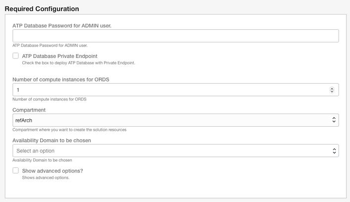
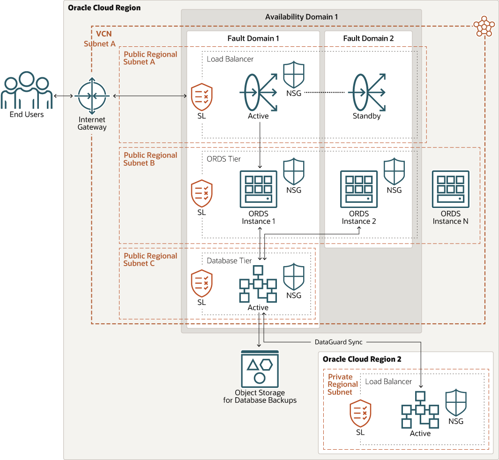

# 

# Deploy Oracle REST Data Services with High Availability in OCI (oci-arch-ords-ha)

The Deploy Oracle REST Data Services with High Availability in OCI reference architecture will create a sample deployment in OCI showcasing how easy it is to get HA with ORDS. The Resource Manager template will automatically deploy a load balancer that will front end N ORDS compute nodes. What N equal is up to you. These ORDS mid-tiers are all connecting back to an Autonomous Database. We use an Autonomous Database in this sample deployment but in a real production deployment, the database could be an Autonomous Database, a VM Database or an ExaCS Database. Lastly, this sample is using HTTP and not HTTPs. For Production deployment it is strongly encouraged to use HTTPS from at least the client to the load balancer.

When creating this Resource Manager Stack, you will have a few options to choose as part of the Required Configuration step.



- ATP Database Password for ADMIN user
    Provide a password for the ATP ADMIN user. The rules are: **Password must be 12 to 30 characters and contain at least one uppercase letter, one lowercase letter, and one number. The password cannot contain the double quote (") character or the username "admin".**

- ATP Database Private Endpoint
    Check this checkbox if you want your Autonomous Database to be in a private subnet and not have a public IP.

- Number of compute instances for ORDS
    Set the number of compute instances you want created for ORDS HA with this option.

-  Compartment
    What compartment do you want these resources/services created in. Defaults to your current compartment.

- Availability Domain to be chosen
    Use the dropdown select list to choose an Availability Domain to create the resources/services in.

For details of the architecture, see [_Deploy Oracle REST Data Services with High Availability in OCI_](https://docs.oracle.com/en/solutions/arch-ords-ha/index.html)

## Prerequisites

[Quickstart Prerequisites](https://github.com/oracle-quickstart/oci-prerequisites)

- Permission to `manage` the following types of resources in your Oracle Cloud Infrastructure tenancy: `vcns`, `internet-gateways`, `route-tables`, `network-security-groups`, `subnets`, `autonomous-database-family`, and `instances`.

- Quota to create the following resources: 1 VCN, 2 subnets, 1 Internet Gateway, 1 NAT Gateway, 2 route rules, 1 ATP database instance, and 2 compute instances.

If you don't have the required permissions and quota, contact your tenancy administrator. See [Policy Reference](https://docs.cloud.oracle.com/en-us/iaas/Content/Identity/Reference/policyreference.htm), [Service Limits](https://docs.cloud.oracle.com/en-us/iaas/Content/General/Concepts/servicelimits.htm), [Compartment Quotas](https://docs.cloud.oracle.com/iaas/Content/General/Concepts/resourcequotas.htm).

## Deploy Using Oracle Resource Manager

1. Click [](https://cloud.oracle.com/resourcemanager/stacks/create?region=home&zipUrl=https://github.com/oracle-quickstart/oci-arch-ords-ha/releases/latest/download/oci-arch-ords-ha-stack-latest.zip)

    If you aren't already signed in, when prompted, enter the tenancy and user credentials.

2. Review and accept the terms and conditions.

3. Select the region where you want to deploy the stack.

4. Follow the on-screen prompts and instructions to create the stack.

5. After creating the stack, click **Terraform Actions**, and select **Plan**.

6. Wait for the job to be completed, and review the plan.

    To make any changes, return to the Stack Details page, click **Edit Stack**, and make the required changes. Then, run the **Plan** action again.

7. If no further changes are necessary, return to the Stack Details page, click **Terraform Actions**, and select **Apply**. 

8. When the job is finished, you will see the Load Balancer IP/URL for accessing Database Actions for your Autonomous Database. Login with the **ADMIN** user and the password you supplied when creating the job.


## Deploy Using the Terraform CLI

### Clone the Repository
Now, you'll want a local copy of this repo. You can make that with the commands:

    git clone https://github.com/oracle-quickstart/oci-arch-ords-ha.git
    cd oci-arch-ords-ha
    ls

2. Create a `terraform.tfvars` file, and specify the following variables:

```
# Authentication
tenancy_ocid         = "<tenancy_ocid>"
user_ocid            = "<user_ocid>"
fingerprint          = "<finger_print>"
private_key_path     = "<pem_private_key_path>"

# Region
region = "<oci_region>"

# Availability Domain 
availability_domain = "<availability_domain_number>"
### USE ONE ^ OR THE OTHER v
availability_domain_name = "<availability_domain_name>"

# Compartment
compartment_ocid = "<compartment_ocid>"

# database
ATP_password           = "<ATP_user_password>"

````

### Create the Resources
Run the following commands:

    terraform init
    terraform plan
    terraform apply

### Destroy the Deployment
When you no longer need the deployment, you can run this command to destroy the resources:

    terraform destroy

## Topology

The following diagram shows the topology created by this stack.

# 

## Known Issues
When using an Autonomous Database with a Private Endpoint, you will recieve the following error:

Error Message: Failed to create a private endpoint for the Autonomous Database because OBO tokens are not supported for use with a private endpoint.

Workaround: Use an Autonomous Database with a public endpoint 
